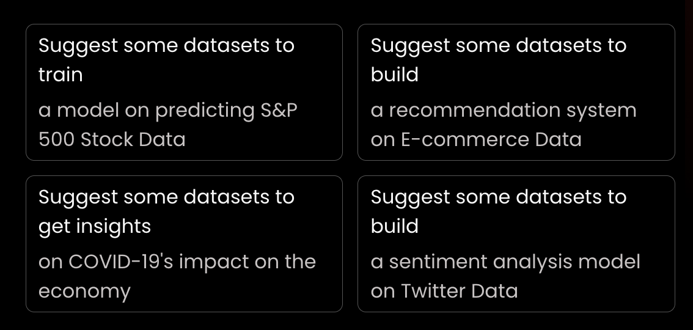

<!-- PROJECT SHIELDS -->
[![LinkedIn][linkedin-shield]][linkedin-url]
[![Twitter][twitter-shield]][twitter-url]

<!-- PROJECT LOGO -->
 

  

  <h3 align="center">CognideX Template</h3>

  

    One Stop for All Data Exchange
     
    <a href="https://github.com/Decentralized-Data-Marketplace/CognideX-README"><strong>Explore the docs</strong></a>
     
     
    <a href="https://github.com/Decentralized-Data-Marketplace/CognideX-README">View Demo</a>
  

<!-- TABLE OF CONTENTS -->

  
Table of Contents

  <ol>
    <li>
      <a href="#about-the-project">About The Project</a>
      <ul>
        <li><a href="#built-with">Built With</a></li>
      </ul>
    </li>
    <li>
      <a href="#getting-started">Getting Started</a>
    </li>
    <li><a href="#usage">Usage</a></li>
    <li><a href="#roadmap">Roadmap</a></li>
    <li><a href="#license">License</a></li>
    <li><a href="#contact">Contact</a></li>
    <li><a href="#acknowledgments">Acknowledgments</a></li>
  </ol>

<!-- ABOUT THE PROJECT -->
## About The Project

[![CognideX Screen Shot][product-screenshot]](https://www.cognidex.ai)

CognideX is a decentralized data marketplace built on the Polkadot ecosystem that incentivizes users for the high-quality data they provide. Users contribute to data pools and receive rewards in our native token, CGDX, based on the quality of their submissions. What sets us apart from other data marketplaces is our use of blockchain technology to verify each transaction, ensuring that all collected data is authentic and reliable. We prioritize user privacy by masking personal identifiable information (PII) and assigning each user an anonymous unique identifier hash.

We merge individual data pools into a single, comprehensive Data Pool containing all user-uploaded data. This consolidation is achieved using cutting-edge AI technology while maintaining each user's unique identifier hash. With this extensive Data Pool, we can easily provide valuable insights into target markets.

In addition to user-contributed data, CognideX features access to 22,000 datasets from across the internet. Our smart assistant, powered by Large Language Model (LLM) agents, seamlessly fetches these datasets, enabling users to search for datasets based on specific use cases. By leveraging LLMs, users can generate crystal-clear insights through any query, accessing information from an agent that has in-depth knowledge of both user-uploaded data and external datasets.

(<a href="#readme-top">back to top</a>)

### Built With

CognideX is built on the following:

* [![React][React.js]][React-url]
* [![fastapi][fastapi]][fastapi-url]
* [![moonbeam][Moonbeam]][Moonbeam-url]

(<a href="#readme-top">back to top</a>)

<!-- GETTING STARTED -->
## Getting Started

CognideX is a decentralised data marketplace that empowers users to monetize their data and facilitate access to over 22,000 datasets via our smart assistant.

CognideX Ecosystem aims to provide a platform where users can monetize their data, whilst also providing privacy and security. We believe that data is the new oil, and we want to empower users to take control of their data and monetize it in a secure and private way. We aim to allow everyone to monetise data that you generate every day and get the true worth of your data.

Here are some statistics of how much these companies earn for your data:

| Social Media | Average Screentime per day | ARPU (Average Revenue Per User) per year |
|--------------|:--------------------------:|:----------------------------------------:|
| Facebook     | 33 min                     | $295                                     |
| Instagram    | 29 min                     | $294                                     |
| TikTok       | 32 min                     | $97                                      |
| Snapchat     | 28 min                     | $57                                      |
| Twitter      | 31 min                     | $79                                      |
| YouTube      | 44 min                     | $42                                      |

We believe that you should be able to monetize your data, and not these companies.

Our mission in CognideX is to allow everyone to be able to make full use of the data they generate, not only that but for the data buyers to get what they want. CognideX has 2 main components, using these 2 components, users can easily access and monetize data.

1. Data Pools
Data Pools are where users can contribute their data in exchange for CGDX tokens (our native token). The data is then made available to other users.

2. Smart Assistant
The CognideX Smart Assistant is a conversational AI that helps users to access 22,000 datasets over the internet.

<!-- USAGE EXAMPLES -->
## Usage

### Data Pools
Datasets that are formed by aggregating many individual datasets from users. Users can contribute their data to these pools in exchange for CGDX tokens. The data is then made available to other users.

#### Mechanics of Data Pools
Each Data Pool will have the following attributes:

**1. Token Allocated:** The amount of CGDX tokens that are allocated to the pool.

**2. Minimum Data Quality Score:** The minimum quality score of data that can be contributed to the pool.

**3. Max Incentive per User:** The maximum number of CGDX tokens that can be earned by a user for contributing data to the pool.

**4. An Option to Stake:** Users can stake their CGDX tokens to the pool to earn a share of the pool's rewards if this option is enabled.

**5. Price:** The price at which users can access the data in the pool.

### Data Pool Lifecycle
The lifecycle of a data pool is as follows:

#### 1. Data Pool Creation
- Any one can create a data pool. 
- The creator of the pool will have to specify the attributes mentioned above. 
- The creator will need to hold a certain amount of CGDX tokens to create a pool.

#### 2. Data Pool Usage
- Users can access the data in the pool by paying the price set by the pool creator. 
- The price will be in CGDX tokens.
- The data quality score of the data in the pool will be displayed to the user before they decide to access the data.

#### 3. Data Pool Rewards
- Users can earn CGDX tokens by contributing data to the pool. 
- The amount of tokens earned will depend on the quality of the data contributed. 
- The data quality score will be calculated by the CognideX platform.

#### 4. Data Pool Staking
- Users can stake their CGDX tokens to the pool to earn a share of the pool's sale. 
- The share of rewards will depend on the amount of tokens staked by the user. 
- The staking option will be enabled by the pool creator.

#### 5. Data Pool Closure
- Once the token allocation of the pool is exhausted, the pool will be closed for contribution. 
- Users can still access the data in the pool by paying the price set by the creator. 
- The creator can choose to close the pool at any time.

#### 6. Price Proposals
- Anyone can negotiate for a deal with the pool creator to access the data in the pool at a different price. 
- The creator will then create the proposal and the user can accept or reject the proposal.

#### 7. Contributing Data to a Data Pool
- To contribute data to a data pool, users will have to follow the steps the creator of the pool has set. 
- The data quality score of the data will be calculated by the CognideX platform. 
- The user will be rewarded with CGDX tokens based on the quality of the data contributed.

> **For Example:** 
If a user contributes data with a quality score of 8, and the max incentive per user is 100 CGDX tokens, the user will earn 80 CGDX tokens.

### Smart Assistant
An AI-powered conversational assistant that helps users access datasets on the CognideX platform. The Smart Assistant is designed to help users find the data they need quickly and efficiently.

> **Tip:** Search for datasets much faster using the Smart Assistant!

#### Use Case Search
With natural language processing capabilities, the Smart Assistant can understand user queries and provide relevant datasets. Users can ask questions like "What is the GDP of India?" or "Show me the population of China" and the Smart Assistant will provide the relevant datasets available on the platform.

Some examples are as follows:

    

#### Filtering Search Results
Searching using the smart the Smart Assistant may give you datasets that are not drill-down to the specific data you need. You can then ask another question to filter the results. For example, if you ask "I would like some wine datasets to build a recommendation system", you may get multiple datasets. You can then ask "Can you filter datasets from Hong Kong?" to filter the results specific to that region.

#### Data Source Information
The Smart Assistant has access to all the data in our platform and can provide information about the data source. It will provide a link to the original source of the data so you can verify the information and download the respective dataset.

#### Use Case based Recommendation
The user can also input use cases in the Settings page (only available in the Consumer Profile for now) to personalize the datasets available in the Recommended Section. Multiple use cases can be entered for a broader range of recommendations.

(<a href="#readme-top">back to top</a>)

<!-- ROADMAP -->
## Roadmap

- [x] Improved Smart Assistant Module
- [x] Improved UI
- [x] Upgraded Smart Contracts over Moonbeam
- [x] Deployed New Blockchain powered Data Pipeline
- [x] Tested over new backend on AWS
- [x] Deployed MVP
- [ ] Beta Testing
- [ ] Buying and Selling Data Functionality
- [ ] Multi-language Support for Smart Assistant
- [ ] Creation of custom Data Pools
- [ ] Data Fusion
- [ ] Ability to purchase TestNet Tokens

(<a href="#readme-top">back to top</a>)

<!-- LICENSE -->
## License

Distributed under the MIT License. See `LICENSE.txt` for more information.

(<a href="#readme-top">back to top</a>)

<!-- CONTACT -->
## Contact

CognideX - [@0xcognidexAI](https://x.com/0xcognidexAI) - info@cognidex.ai

Jia Ye Tey - [@JiayeTey](https://x.com/JiayeTey) - bizv1086@partner.nus.edu.sg

Bhargav Sagiraju - [@bargovis](https://x.com/bargovis) - bhargavs@nus.edu.sg

Project Link: [CognideX](https://www.cognidex.ai/)

(<a href="#readme-top">back to top</a>)

<!-- ACKNOWLEDGMENTS -->
## Acknowledgments

We would like to acknowledge the following resources and organizations that have helped us build CognideX and turn it into what it is today:

* [Moonbeam](https://moonbeam.network/)
* [Polkadot](https://polkadot.com/)
* [React](https://react.dev/)
* [AWS](https://aws.amazon.com/)
* [NUS AIDF](https://www.aidf.nus.edu.sg/)

Sincere thanks for all your help throughout 🙏

(<a href="#readme-top">back to top</a>)

<!-- MARKDOWN LINKS & IMAGES -->
<!-- [license-shield]: https://img.shields.io/github/license/Decentralized-Data-Marketplace/CognideX-README
[license-url]: https://github.com/Decentralized-Data-Marketplace/CognideX-README/blob/main/LICENSE.txt -->
[linkedin-shield]: https://img.shields.io/badge/-LinkedIn-black.svg?style=for-the-badge&logo=linkedin&colorB=555
[linkedin-url]: https://www.linkedin.com/company/cognidex-sg/
[twitter-shield]: https://img.shields.io/badge/-X/Twitter-black.svg?style=for-the-badge&logo=X&colorB=555
[twitter-url]: https://x.com/0xcognidexAI
[product-screenshot]: images/cgdx-screenshot.png

[React.js]: https://img.shields.io/badge/React-000000?style=for-the-badge&logo=react&logoColor=green
[React-url]: https://reactjs.org/
[fastapi]: https://img.shields.io/badge/fastapi-000000?style=for-the-badge&logo=fastapi&logoColor=red
[fastapi-url]: https://fastapi.tiangolo.com/
[Moonbeam]: https://img.shields.io/badge/moonbeam-000000?style=for-the-badge&logo=moonbeam&logoColor=white
[Moonbeam-url]: https://moonbeam.network/
